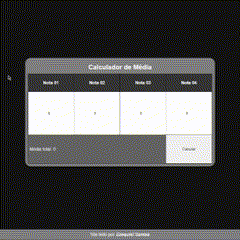
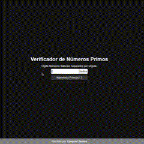
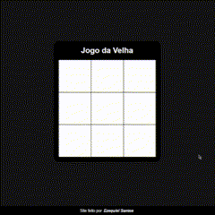
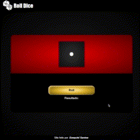

# Projetos em JavaScript puro
Criei esse repositório para praticar e aperfeiçoar minhas abilidades com o JavaScript puro.
---
## Projetos
<table>
    <tr>
        <td>
            <h3><a href="https://ezzysant.github.io/Projects-JavaScript/calc-media/index.html">00 - Calculador de Média</a></h3>
            <li><a href="./calc-media/">Code</a></li>
            
        </td>
        <td>
            <h3><a href="https://ezzysant.github.io/Projects-JavaScript/numb-primos/index.html">01 - Números Primos</a></h3>
            <li><a href="./numb-primos/">Code</a></li>
            
        </td>
        <td>
            <h3><a href="https://ezzysant.github.io/Projects-JavaScript/to-do-list/index.html">02 - Lista To-Do</a></h3>
            <li><a href="./to-do-list/">Code</a></li>
            
        </td>
    </tr>
    <tr>
        <td>
            <h3><a href="https://ezzysant.github.io/Projects-JavaScript/tic-tac-toe/index.html">03 - Jogo da Velha</a></h3>
            <li><a href="./tic-tac-toe/">Code</a></li>
            
        </td>
        <td>
            <h3><a href="https://ezzysant.github.io/Projects-JavaScript/hangman/index.html">04 - Jogo da Forca</a></h3>
            <li><a href="./hangman/">Code</a></li>
            
        </td>
        <td>
            <h3><a href="https://ezzysant.github.io/Projects-JavaScript/rolldice/index.html">05 - Jogando Dados</a></h3>
            <li><a href="./rolldice/">Code</a></li>
            
        </td>
    </tr>
</table>
